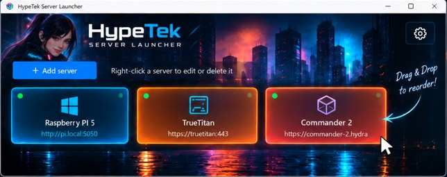

<p align="center">
  
</p>

<h1 align="center">HypeTek Bookmarker</h1>

<p align="center">
  A lightweight, portable bookmark launcher for Windows 10/11 that opens servers, NAS systems and web interfaces with one click.
</p>

<p align="center">
  
  
  
  
</p>

## Features

- **One-click bookmark access** in your default browser
- **Drag & Drop reordering** with persistent tile order
- Add, edit and delete bookmark entries
- Hostnames, IP addresses, FQDNs and custom ports
- Multiple entries can use the same host with different ports
- Per-entry button colors plus a configurable default color
- **Bundled HypeTek cyberpunk default wallpaper for fresh installs**
- Custom wallpaper support: **BMP, PNG, JPG/JPEG, GIF and TIFF**
- Wallpaper modes: Fill, Fit and Stretch
- Adjustable wallpaper dimming
- **Bundled neon device icon set** for Server, PC, Laptop, Website, NAS, Router, Raspberry Pi, VM and Generic targets
- Automatic icon detection or manual per-server icon selection
- Saved address shown below each tile label
- Icon-specific neon accent borders
- Languages: **Deutsch, English, Русский**
- Compact dynamic layout with scrolling for larger collections
- Right-click a tile to edit or delete it
- Portable: no installer and no administrator rights required
- **Subtle “Default design” reset** in Settings; it resets appearance only and never deletes bookmark entries

## v3.6 preview behavior

The new cyberpunk appearance is used automatically only when no `settings.json` exists yet.

Existing installations keep their current wallpaper, colors and settings after updating. To switch an existing installation to the bundled appearance, open **Settings** and use the small **Default design** button, then click **Apply**.

The reset affects only:

- default button color
- wallpaper
- wallpaper mode
- wallpaper dimming

It does **not** change or delete saved bookmarks.

## Download

Stable ready-to-use builds are published under **GitHub Releases**.

1. Open **Releases** on the right side of the repository page.
2. Download the newest Windows ZIP.
3. Extract the complete archive, including the `resources` folder.
4. Start `Start_Bookmarker.vbs`.

For troubleshooting, start `Start_Bookmarker.bat` instead. It keeps the console open if startup fails and the launcher can write details to `Error.txt`.

## Usage

1. Start the launcher.
2. Click **Add entry**.
3. Enter a label and address.
4. Optionally choose an individual button color and icon.
5. Click a tile to open it.
6. Hold the left mouse button and drag a tile onto another tile to change the order.
7. Right-click a tile to edit or delete it.
8. Use the gear button to change language, default color, wallpaper and display settings.

Addresses without a protocol automatically use `http://`.

```text
192.168.1.10
server.local
server.local:8080
desktop-njdiu99.hydra-wrasse.ts.net
https://server.local:8443
```

## Bundled resources

The application ships with the visual resources required for the default appearance:

```text
resources/
├─ default-wallpaper.jpg
└─ device-icons.png
```

The launcher reads the bundled device symbols from one compact sprite sheet and falls back to Windows glyphs if the sprite cannot be loaded.

## Configuration & privacy

In a normal writable folder, user configuration is stored next to the program:

```text
servers.json
settings.json
assets/
Error.txt
```

`assets/` is reserved for **user-selected wallpapers** and is intentionally excluded from the Git repository. Bundled project artwork lives in `resources/`.

If the launcher is placed under `C:\Program Files`, `C:\Program Files (x86)` or another protected/read-only location, personal data is stored automatically in:

```text
%LOCALAPPDATA%\HypeTek\ServerLauncher
```

No administrator rights are required.

The launcher does not send saved addresses or settings anywhere.

## Rebrand compatibility

The project was renamed from **HypeTek Server Launcher** to **HypeTek Bookmarker**. Existing configurations remain compatible. The internal `%LOCALAPPDATA%\HypeTek\ServerLauncher` data path and the core `ServerLauncher.ps1` filename are intentionally retained for now so upgrades do not lose saved entries or settings.

## Requirements

- Windows 10 or Windows 11
- Windows PowerShell 5.1
- WPF / .NET components included with Windows

No additional runtime is required.

## Repository files

```text
ServerLauncher.ps1       Main application core (legacy filename kept for compatibility)
Start_Bookmarker.vbs     Recommended silent launcher
Start_Bookmarker.bat     Troubleshooting launcher
Start_ServerLauncher.*   Compatibility launchers for existing installations
resources/               Bundled wallpaper and device icons
docs/                    README screenshots
README.md                Project documentation
CHANGELOG.md             Version history
SECURITY.md              Security information
LICENSE                  MIT License
```

## Version

Stable release: **v3.6**  
Next release / rebrand: **v3.7 HypeTek Bookmarker**

### v3.7 rebrand highlights

- Bundled cyberpunk default wallpaper
- Bundled neon icon set instead of emoji-only presentation
- Tile addresses displayed in the main UI
- Neon accent borders based on device type
- Non-intrusive “Default design” reset
- Existing installations keep their settings during an update

## Deutsch

Der **HypeTek Bookmarker** ist ein portabler Windows-Bookmarker für Weboberflächen, NAS, Server, PCs und andere Netzwerkziele.

Ab v3.6 bringt eine frische Installation bereits das HypeTek-Cyberpunk-Wallpaper und passende Gerätesymbole mit. Bestehende Konfigurationen werden beim Update **nicht überschrieben**. Wer das neue Standarddesign übernehmen möchte, kann es in den Einstellungen über den kleinen Button **Standarddesign** laden.

Der Design-Reset verändert ausschließlich Darstellungseinstellungen und löscht keine Einträge.

## License

HypeTek Bookmarker is released under the **MIT License**.

Copyright © 2026 HypeTek. See [`LICENSE`](LICENSE) for the full license text.
